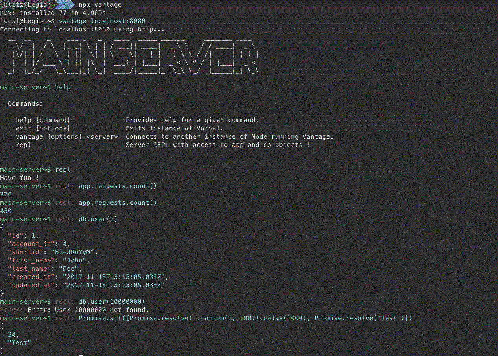

# Vantage REPL - ES6 & Context

[](https://nodei.co/npm/vantage-es6-contextified-repl/)

[](https://travis-ci.org/BlitzBanana/vantage-es6-contextified-repl)
[](https://codecov.io/gh/blitzbanana/vantage-es6-contextified-repl)
[](https://github.com/sindresorhus/xo)
[](https://github.com/prettier/prettier)
[](https://lass.js.org)
[](LICENSE)


## Table of Contents

* [Install](#install)
* [Usage](#usage)
  * [Options](#options)
* [Contributors](#contributors)
* [License](#license)


## Install

[npm][]:

```sh
npm install vantage-es6-contextified-repl
```

[yarn][]:

```sh
yarn add vantage-es6-contextified-repl
```


## Usage

```js
import Vantage from 'vantage'
import repl from 'vantage-es6-contextified-repl'
import chalk from 'chalk'
import figlet from 'figlet'

new Vantage()
  .use(repl, {
    delimiter: chalk.red('repl:'),
    description: 'Server REPL with access to app and db objects !',
    banner: 'Have fun !',
    context: { infos, app, db },
    formatter: 'highlight'
  })
  .banner(figlet.textSync('MAIN SERVER'))
  .delimiter(chalk.green('main-server~$'))
  .listen(8080)
  .show()
```



### Options

* `mode` - the command to type to enter in REPL mode, default to `repl`.
* `description` - the mode description displayed in help menu, default to `Enters REPL mode.`.
* `banner` - the welcome message displayed when entrering in REPL mode, default to: `Entering REPL Mode. To exit, type 'exit'`.
* `delimiter` - the additional delimiter of the mode, default to `repl:`.
* `timeout` - the maximum amout of time to eval the code, default to `15000`.
* `context` - the REPL context, accessible from evalued code, default to `{}`.
* `compiler` - the code transformation functon, set `null` or a functon using signature `function(code:string)` and that returns a `string`, the default function uses Babel.
* `formatter` - the output transformation functon, set `highlight`, `none` or a functon using signature `function(input:string)` and that returns a `string`, default to `highlight`.

> TODO: Multiline support
> TODO: Make an option to use a custom or predefined theme for `highlight` formatter


## Contributors

| Name                       |
| -------------------------- |
| **Victor Rebiard--Crépin** |


## License

[MIT](LICENSE) © Victor Rebiard--Crépin


## 

[npm]: https://www.npmjs.com/

[yarn]: https://yarnpkg.com/
